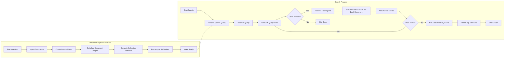

# Overview

This is a pure typescript implementation of the BM25 retrieval algorithm with no runtime dependencies.

The package exports a class BM25Search, which has two primary methods:

- `.addDocuments` which creates an inverted term-frequency index and computes relevant statistics about the documents
- `.search` which returns relevant documents based on a search term.

This API is based loosely off of the `js-search` package.

## BM25 Architecture

# Prior Art

This is heavily influenced by the [`BM25S` project](https://github.com/xhluca/bm25s) in Python.

# Citations

TODO
