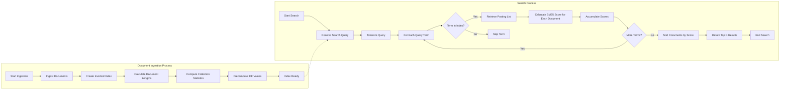

# Overview

This is a pure typescript implementation of the BM25 retrieval algorithm with no runtime dependencies.

The package exports a class BM25Search, which has two primary methods:

- `.addDocuments` which creates an inverted term-frequency index and computes relevant statistics about the documents
- `.addIndex` adds an indexed field for the search documents
- `.search` which returns relevant documents based on a search term.

This API is a drop-in replacement for the `js-search` package.

## BM25 Architecture

First, the implementation broadly looks like:

Preprocessing:

- Tokenize documents and queries
- Remove stopwords (optional)
- Apply stemming or lemmatization (optional)

Index creation:

- Build an inverted index mapping terms to documents
- Calculate and store document lengths
- Compute average document length

IDF calculation:

- For each term, calculate its inverse document frequency

Scoring function:

- Implement the BM25 formula
- Set tuning parameters k1 and b

Query processing:

- Preprocess the query (tokenize, remove stopwords, etc.)
- For each query term:
  - Retrieve matching documents from the inverted index
  - Calculate the BM25 score contribution
- Sum scores for each document

Ranking:

- Sort documents by their total BM25 scores
- Return top N results

# Todos

- [ ] Add Performance Testing Suite
- [ ] Make a better API (closer to js-search) to
- [ ] Optimize Data Structures of Inverted Index and related statistics for calculating f_qi_idx without creating a new Set
- [ ] Allow for filtered results i.e. don't always return all documents
- [ ] Implement other BM25 variants
- [ ] Publish package on Github and publish package to npmjs
- [ ] Remove stopwords in index step
- [ ] Apply stemming or lemmatization
- [ ] Make tokens lower-case / case-insensitive

# Prior Art

This is heavily influenced by the [`BM25S` project](https://github.com/xhluca/bm25s) in Python.

# Citations

TODO
